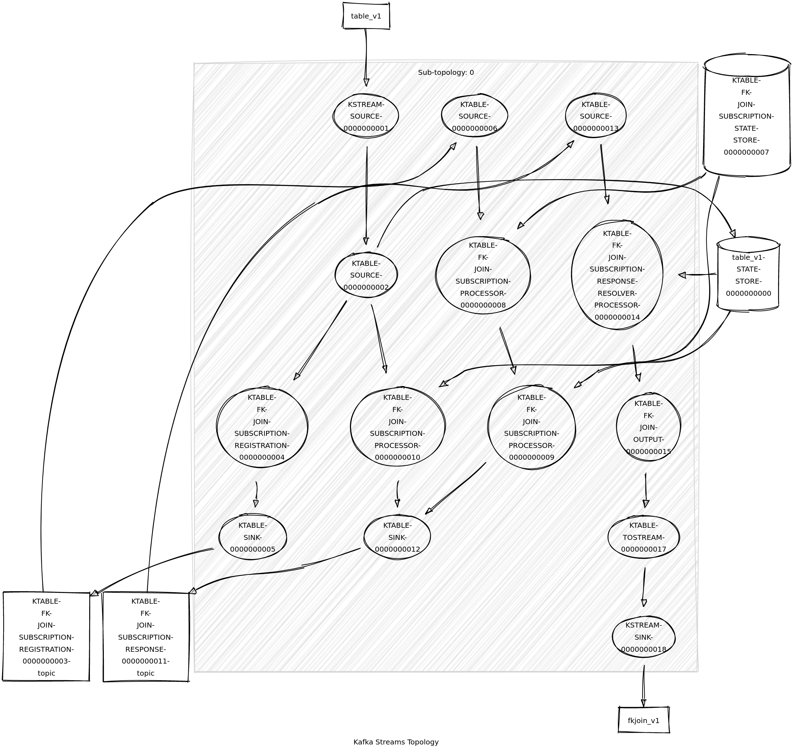

KTable to KTable foreign-key joins is one of the coolest features in Kafka Streams.

I was wondering whether this feature would handle FK-joins between values on the same table.

<!--more-->
Seems that the answer is yes:

```java
var ktable = builder.table("table", Consumed.with(Serdes.String(), Serdes.String()));
ktable
    .join(ktable, s -> s, (v1, v2) -> v1 + "-" + v2)
    .toStream()
    .to("fkjoin_v1", Produced.with(Serdes.String(), Serdes.String()));
```

Values will be used as keys.
With the following inputs:

```markdown
p1:v1
v1:v2
```

The following output is expected:

```markdown
p1:v1-v2
```

For reference this is the topology graph:


