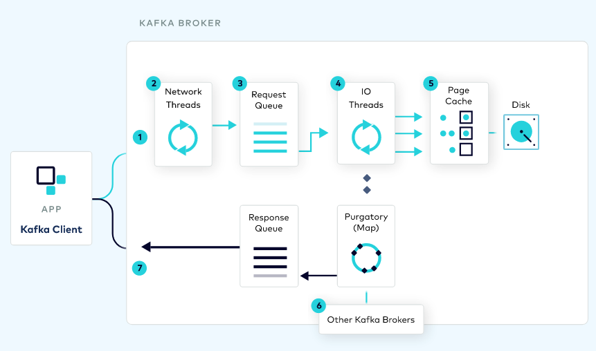

Kafka quotas have been around for a while since the initial versions of the project — though not necessarily being enabled in most deployments.

This post goes through sharing some thoughts on how to start adopting the usage of quotas and giving some practical advice, and a bit of the history of quotas in the Kafka project.

<!--more-->

## Why quotas are important?

Once you're in a multi-tenant environment (i.e. more than 1 team is using a Kafka cluster), it's recommended to use quotas to avoid having any of the tenants over-consuming or monopolizing the cluster resources available.

This doesn't necessarily mean having quotas for each and every application, but it can start with a good default quotas definition for all applications, and then extend them only for the outliers.

If you think about it, you may need to define only _1_ quota to get started; and, if fair enough, it can be the only quota to ever define.

This default quota represents the default SLA for customers: "these are the default ingress and egress bandwidth your application will be allowed to use by default".
If this is enough – the goal is to make the defaults _good_ enough to avoid getting every tenant to request more resources — then no changes to quotas would be needed.
Only the outliers that require higher bandwidth will need additional quotas for their users.

Keep in mind that when quotas are reached, the behavior is to throttle — not to fail.
This is something tenants will have to weigh on to accept a certain quota limit.

## How do start adopting the usage of quotas?

### Identify broker resources to constraint

Understanding the Kafka request lifecycle helps us to identify the resource to constraint:


> Source: https://developer.confluent.io/#kafka-internals

To start with, there is the read and write **throughput bandwidth** (i.e. produce/fetch rate) between clients and brokers.
This metric is driven by the amount of data moved, and it's the first, most common, quota to enforce.

This volume of data can be moved in many or fewer (usually batched) requests.
The number of requests impacts the processing load required on the broker side.
Kafka brokers have 2 thread pools to process these requests: network threads and IO threads.
These thread pools are the second resource to operate.

Then, the connections between clients and brokers.
Clients open connections with a certain frequency.
Having an upper bound on the number of connections created helps to reduce the chances for DoS attacks.

Additionally, there are replication and controller mutation quotas that are for inter-broker communication.
I won't dive into these as I haven't used them in the past and are applied between the brokers.

Estimating the rough amount of resources available per broker is a good exercise, though it can be hard to calculate.

For throughput bandwidth (read/write), the network bandwidth is the resource, and it's shared by the OS processes, broker control plane (admin operations), and the data plane (read/write) including replication.

For processing rates, the formula is defined as `((num.io.threads + num.network.threads) * 100)%.`. By default, there are 8 IO threads and 3 network threads, leading to 11,000 processing units to allocate.
Assuming the broker has 12 CPUs, then each processing unit can represent a milli-CPU.

Connections created limit is more about finding a sensible number.

### Identify applications

Kafka clients can be identified by 2 metadata values:

- `client.id`: optional configuration property to identify client.
- `user`: User principal authenticated, e.g. Common name.

Both metadata values can be mixed to identify an application.
User metadata tends to be easier to apply as if the cluster is secured then the value is always available.
With `client.id` is more difficult as there is no out-of-the-box option to enforce it.

Following the usage of user principal as the application identifier, it depends on how the credentials are used across the applications within a domain.

These are the scenarios I have seen more in the field: 

Let's say there is a Change Data Capture team running multiple connectors,
* Are credentials provided for the whole domain or per connector?
* If the credentials are provided per connector, then it's easier to apply quotas as each connector is independent, and the `user` can be used as a way to identify applications.
* If credentials are shared, then:
  * Are quotas applicable for the whole domain? or it's required to apply it per connector/component?
  * If quotas are applicable per domain, then the `user` can then be used independently.
  * If quotas are applicable per component, then the `user` and `client.id` can be used as a pair to identify

In summary, assuming the cluster is secured, there are 2 ways to approach quotas:

- Using `user` principal only.
- Using `user` principal and `client.id`.

### Define _good_ defaults

Defaults will depend on how applications are identified.
Kafka comes with a hierarchy to apply quotas:

    1. /config/users/<user>/clients/<client-id>
    2. /config/users/<user>/clients/<default> (**)
    3. /config/users/<user> (*)
    4. /config/users/<default>/clients/<client-id>
    5. /config/users/<default>/clients/<default> (**)
    6. /config/users/<default> (*)
    7. /config/clients/<client-id>
    8. /config/clients/<default>

If `user` principal is enough to identify clients, then use (*) 6. first, for all/default users; and 3. for specific users.

On the other hand, if user principal is shared and quotas apply per component, the use (**) 5. first, for all applications; and 2. for all components under a user principal.

The purpose of the initial quota for all users (*) or for all components (**) is to define the default SLA for Kafka applications.
In a multi-tenant environment, this is very useful.
The goal of these defaults is to cover most (e.g. ~80%) of your applications and only add specific quotas for the outliers.
If the defaults are _too_ low, then applications will need to be micromanaged, increasing the complexity to operate quotas. 

Either way, try to stick to one way to identify applications across a cluster.
This will simplify managing quotas, knowing which quota applies to a specific application and provide the right metrics.

Confluent Cloud Bandwidth limits per partition represent a good default in my view: `Write=5MB/s`, `Read=15MB/s`.

> Note about Confluent Cloud: The scope of quotas in Apache Kafka is a broker. However, in Confluent Cloud, limits are applied per Cluster and Partition https://docs.confluent.io/cloud/current/clusters/cluster-types.html

The processing rate quotas are a bit harder to specify in my experience as it depends on the processing power available on the brokers (i.e. number of CPUs).
A potentially good default value could be `1000` — assuming 1 thread/1 CPU relation — to state that a client can at most use 1 CPU.
Batching requests for high-load clients tends to be a good way to reduce processing demand by reducing the number of requests.

For connections created, Confluent Cloud is also a good reference: 250 is the maximum number of requests that could be created.

### Monitor application quotas

One very interesting side effect of enabling quotas is that a new set of metrics are enabled on the brokers.
These metrics start to track: resources used by applications and throttling.

If these metrics are collected, then applications can be monitored from the broker side, reducing the need to monitor each application — which is still recommended but involved much more work.

### Adjust quotas / Scale cluster

Quotas are controlled by a broker.
This means that if an application is writing data to multiple partitions across different brokers, the quotas will only be collected per broker and validated on that scope.
If new brokers are added to the cluster, and the cluster is rebalanced, the quotas will still be applied per individual broker.

Hypothetically, if the cluster is large enough then a broker could be hosting one partition, and the quotas will apply to that one partition.
This is why I think the Confluent Cloud limits per partition are a valid reference.

By monitoring application quotas and throttling, operators can identify —even proactively— applications that are reaching limits and may require higher quota limits or scaling the cluster to reduce the partitions allocated per broker when rebalanced.

## Bonus: \`kfk-quotas\`, a CLI to manage quotas

KIP-546 is supposed to add a new —and better— CLI to manage Quotas.
At the moment the CLI to manage quotas is included as part of `kafka-configs` which is not the most user-friendly tool for this specific entity.

Therefore, I created a single CLI to manage quotas: https://github.com/jeqo/poc-apache-kafka/tree/main/cli/quotas

Following the first (identifying applications only by user), here is a demo:

1. Create default quota:

```shell
$ kfk-quotas create --kafka cp-demo \
  --user-default \
  --produce-rate 5000000 --fetch-rate 15000000
```

2. Get list of quotas:

```shell
$ kfk-quotas query --kafka cp-demo 2> /dev/null | jq .
[
  {
    "clientEntity": {
      "user": {
        "default": true
      }
    },
    "constraints": {
      "producer_byte_rate": 5000000,
      "consumer_byte_rate": 15000000
    }
  }
]
```

3. Check application quota metrics:


4. Apply a specific metric for a user:

```shell
kfk-quotas create --kafka cp-demo \
  --user controlcenterAdmin \
  --produce-rate 10000 --fetch-rate 60000
```

```shell
$ kfk-quotas query --kafka cp-demo 2> /dev/null | jq
[
  {
    "clientEntity": {
      "user": {
        "default": true
      }
    },
    "constraints": {
      "producer_byte_rate": 5000000,
      "consumer_byte_rate": 15000000
    }
  },
  {
    "clientEntity": {
      "user": {
        "user": "controlcenterAdmin"
      }
    },
    "constraints": {
      "producer_byte_rate": 10000,
      "consumer_byte_rate": 60000
    }
  }
]
```

5. And check that throttling starts to kick in:


This short demo captures most of the workflow on how to adopt quotas:

- Define defaults depending on your applications identifiers.
- Monitor resources used by application
- Apply specific quotas for outliers, and iterate.

## Appendix: Quotas history

Quotas have been available in Apache Kafka from very early versions:

* [KIP-13: Quota Design](https://cwiki.apache.org/confluence/display/KAFKA/KIP-13+-+Quotas) was adopted in the release `0.9.0`.
It included setting quotas by using `client.id`, and only for `bandwidth` (i.e. produce and fetch bytes per second).
It already includes the concept of _default_ quotas which would apply to every application, and also mentions the use of metrics to measure bandwidth per client.
* [KIP-55: Secure Quotas for Authenticated Users](https://cwiki.apache.org/confluence/display/KAFKA/KIP-55%3A+Secure+Quotas+for+Authenticated+Users) —adopted in the release `0.10.1`— brings the concept User principals to identify applications.
This is an important enhancement as it `client.id` is an optional configuration and hard to enforce.
With User principals, we already have this metadata available on the secured cluster.
It also defines the order of precedence that applies even today:

```
    /config/users/<user>/clients/<client-id>
    /config/users/<user>/clients/<default> (**)
    /config/users/<user> (*)
    /config/users/<default>/clients/<client-id>
    /config/users/<default>/clients/<default> (**)
    /config/users/<default> (*)
    /config/clients/<client-id>
    /config/clients/<default>
```

* [KIP-73: Replication Quotas](https://cwiki.apache.org/confluence/display/KAFKA/KIP-73+Replication+Quotas) —adopted since `0.10.1`— adds quotas to limit the resources used by inter-broker replication.
* [KIP-124: Request rate quotas](https://cwiki.apache.org/confluence/display/KAFKA/KIP-124+-+Request+rate+quotas) —since `0.11.0`— introduce the concept of processing rate quotas to limit the amount of thread time used by an application.
* [KIP-219: Improve quota communication](https://cwiki.apache.org/confluence/display/KAFKA/KIP-219+-+Improve+quota+communication) —since `2.0`— improves the feedback loop to reply faster to clients when the broker identifies limits are reached.
* [KIP-257: Configurable Quota Management](https://cwiki.apache.org/confluence/display/KAFKA/KIP-257+-+Configurable+Quota+Management) —`2.0`— deprecates the definition of quotas on the configuration file.
* [KIP-546: Add Client Quota APIs to the Admin Client](https://cwiki.apache.org/confluence/display/KAFKA/KIP-546%3A+Add+Client+Quota+APIs+to+the+Admin+Client) —most recently introduced in `2.6` release— improves the client APIs for managing quotas, and promises to introduce a new CLI for quotas management.
