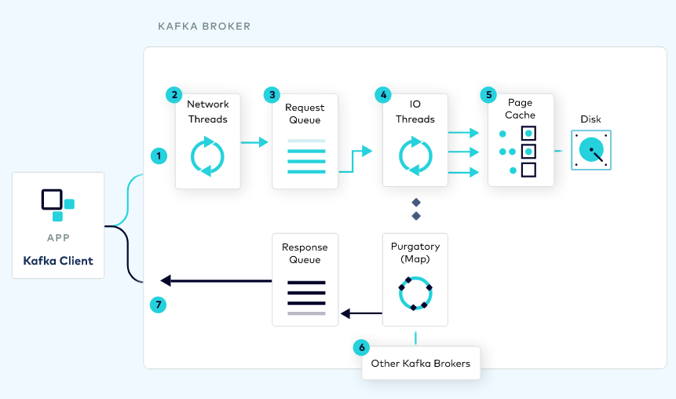

Kafka quotas have been around for a while since the initial versions of the project — though not necessarily being enabled in most deployments.

This post goes through sharing some thoughts on how to start adopting the usage of quotas and giving some practical advice, and a bit of the history of quotas in the Kafka project.

<!--more-->

## Why would you need to use quotas?

Once you're in a multi-tenant environment (i.e. more than 1 team is using a Kafka cluster), it's recommended to use quotas to avoid having any of the tenants over-consuming or monopolizing the cluster resources available.

This doesn't necessarily mean having quotas for each and every application, but it can start with a good default quotas definition for all applications, and then extending them only for the outliers.

If you think about it, you may need to define only _1_ quota to get started; and, if fair enough, it can be the only quota to ever define.

This default quota represents the default SLA for customers: "these are the default ingress and egress bandwidth your application will be allowed to use by default".
If this is enough – the goal is to make the defaults _good_ enough to avoid getting every tenant to request for more resources — then no changes of quotas would be needed.
Only the outliers that require higher bandwidth will need additional quotas for their users.

## How do start adopting the usage of quotas?

### Identify the broker resources to constraint

Understanding the Kafka request lifecycle helps us to identify the resource to constraint:


> Source: https://developer.confluent.io/#kafka-internals

To start with, there is the read and write **throughput bandwidth** (i.e. produce/fetch rate) between clients and brokers.
This metric is driven by the amount of data moved, and it's the first, most common, quota to enforce.

This volume of data can be moved in many or fewer (usually batched) requests.
The number of requests impact the processing load required in the broker side.
Kafka brokers have 2 thread pools to process these requests: network threads and IO threads.
These thread pools are the second resource to operate.

Then, the connections between client and brokers.
Clients open connections with a certain frequency.
Having an upper bound to the number of connections created allow handling.

Additionally, there are replication and controller mutation quotas that are for inter-broker communication.
I won't dive into these as I haven't used them in the past and are applied between the brokers.

### Identify your applications

>

### Define "good" defaults

### Monitor your applications

### Adjust quotas / Scale cluster

## Bonus: \`kfk-quotas\` CLI to manage quotas

```shell
$ kfk-quotas create --kafka cp-demo --user-default --produce-rate 5000000 --fetch-rate 15000000
```

```shell
$ kfk-quotas query --kafka cp-demo 2> /dev/null
[{"clientEntity":{"user":{"default":true}},"constraints":{"producer_byte_rate":5000000.0,"consumer_byte_rate":1.5E7}}]
```


```shell
kfk-quotas create --kafka cp-demo --user controlcenterAdmin --produce-rate 10000 --fetch-rate 60000
```

```shell
$ kfk-quotas query --kafka cp-demo 2> /dev/null
[{"clientEntity":{"user":{"default":true}},"constraints":{"producer_byte_rate":5000000.0,"consumer_byte_rate":1.5E7}},{"clientEntity":{"user":{"user":"controlcenterAdmin"}},"constraints":{"producer_byte_rate":10000.0,"consumer_byte_rate":60000.0}}]
```

```shell
$ date
Wed Apr 20 08:58:40 UTC 2022
```


## Appendix: Quotas history

Quotas have been available in Apache Kafka from very early versions:

* [KIP-13: Quota Design](https://cwiki.apache.org/confluence/display/KAFKA/KIP-13+-+Quotas) was adopted in the release `0.9.0`.
It included setting quotas by using `client.id`, and only for `bandwidth` (i.e. produce and fetch bytes per second).
It already includes the concept of _default_ quotas which would apply to every application, and also mentions the use of metrics to measure bandwidth per client.
* [KIP-55: Secure Quotas for Authenticated Users](https://cwiki.apache.org/confluence/display/KAFKA/KIP-55%3A+Secure+Quotas+for+Authenticated+Users) —adopted in the release `0.10.1`— brings the concept User principals to identify applications.
This is an important enhancement as it `client.id` is an optional configuration and hard to enforce.
With User principals, we already have this metadata available on the secured cluster.
It also defines the order of precedence that applies even today:


    1. /config/users/<user>/clients/<client-id>
    2. /config/users/<user>
    3. /config/users/<default>/clients/<client-id>
    4. /config/users/<default>/clients/<default>
    5. /config/users/<default>
    6. /config/clients/<client-id>
    7. /config/clients/<default>


* [KIP-73: Replication Quotas](https://cwiki.apache.org/confluence/display/KAFKA/KIP-73+Replication+Quotas) —adopted since `0.10.1`—
* [KIP-124: Request rate quotas](https://cwiki.apache.org/confluence/display/KAFKA/KIP-124+-+Request+rate+quotas) —since `0.11.0`—
* [KIP-219: Improve quota communication](https://cwiki.apache.org/confluence/display/KAFKA/KIP-219+-+Improve+quota+communication) —since `2.0`—
* [KIP-257: Configurable Quota Management](https://cwiki.apache.org/confluence/display/KAFKA/KIP-257+-+Configurable+Quota+Management) —`2.0`—
* [KIP-546: Add Client Quota APIs to the Admin Client](https://cwiki.apache.org/confluence/display/KAFKA/KIP-546%3A+Add+Client+Quota+APIs+to+the+Admin+Client) —most recently introduced in `2.6` release—
