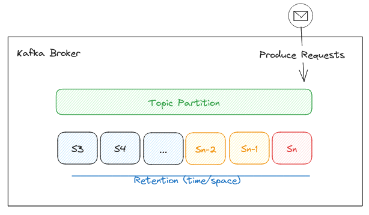

On [version 3.6] Apache Kafka has released an [early-access] version of--the long-awaited--Tiered Storage feature
(proposed as [KIP-405])
extending its storage layer from the comforting local file-system 
to a retention based setup between local and a pluggable remote storage (e.g. AWS S3).

[version 3.6]: https://kafka.apache.org/blog#apache_kafka_360_release_announcement
[early-access]: https://cwiki.apache.org/confluence/display/KAFKA/Kafka+Tiered+Storage+Early+Access+Release+Notes
[KIP-405]: https://cwiki.apache.org/confluence/display/KAFKA/KIP-405%3A+Kafka+Tiered+Storage

Within Tiered Storage, the concept of retention has been extended to specify when data is tiered:
Topic retention settings (`retention.ms|bytes`) keeps representing the retention per partition for all tiers,
but a new configuration for _local_ retention (`local.retention.ms|bytes`) sets how much data to keep on broker's file system.

Let's explore how these retention concepts enable the archival and fetching dataflows.

<!--more-->

Log Segments (data and indexes files) are the physical files backing Kafka topics,
and they are the main unit to manage in tiered storage.

They define the "log" nature of a topic partition, based on how they rotate and the states of each log segment file:

As a reminder, log segment rotation is driven by configurations:

- `segments.bytes` (default: 1GiB) defines how large a segment can be, and
- `segment.ms`: (default: 1 week) how long to wait before forcing log rotation -- regardless of size

and they can be in the following states:

- **Active/Open**: log segment where producer appends record (batches)
- **Closed**: after active segment is rotated, it's considered (mostly) immutable -- at least for non-compacted topics
- **Deleted**: based on retention policies, when a closed segment is outside the retention boundaries, it's deleted.

## Archiving Log Segments

Archiving is the background job that takes care of:

- Copying log segments when they become candidates, and
- Deleting them when log retention triggers a segment deletion

So, when does a log segment becomes a candidate? how does deleting happen between local and remote storage?

### Copying log segments to remote storage

