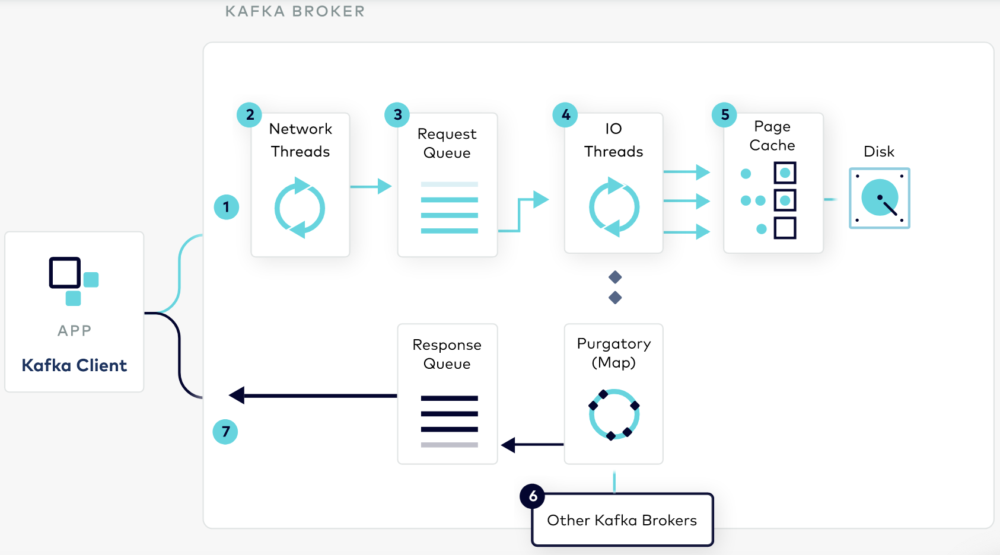

Kafka Producers enforce durability across replicas by setting `acks=all` ([default since v3.0](/til/kafka-v3-idea)).
As enforcing this guarantee requires waiting for replicas to sync, this increases latency; and reducing it tends to give the impression that latency gets reduced overall.

When looking at the end-to-end latency (including production and consumption) this ends up not being the case: 

Records are only available for consumption once the replicas have been updated and the leader can increase the high watermark.

So, `acks` only affect the latency at the producer side.
If the latency that matters to you is end-to-end, then reducing acks might not be the right trade-off. 

## References

- Tail latency at Scale: https://www.confluent.io/blog/configure-kafka-to-minimize-latency/
- Optimizing Kafka for Latency: https://docs.confluent.io/cloud/current/client-apps/optimizing/latency.html
- Kafka Internal https://developer.confluent.io/#kafka-internals, with requests lifecycle

